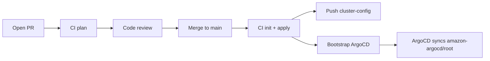

## infra (Terraform)

This folder represents the **Infrastructure repo**. Everything runs through **GitHub Actions** — no local `terraform init` or `terraform apply` is required.

### Repo
- `https://github.com/thuyein97/Amazon-Prime-Terraform-Repo.git`

### Production pipeline (CI-only)

| Event | What runs |
|-------|-----------|
| **Pull request** | `fmt` → `init` → `validate` → `plan` (plan saved as artifact) |
| **Merge to `main`** | `init` → `apply` → publish gitops bridge → bootstrap ArgoCD |
| **Manual dispatch** | Choose `plan`, `apply`, or `destroy`; optional ArgoCD bootstrap on apply |

Production controls in place:
- **Remote state** — S3 with native lockfile (no local state files, no DynamoDB)
- **OIDC auth** — no long-lived AWS keys in the main pipeline
- **GitHub Environment `production`** — add required reviewers in repo Settings → Environments for apply, destroy, and ArgoCD jobs
- **Concurrency lock** — prevents overlapping applies on the same branch
- **Path filters** — pipeline runs only when Terraform/ArgoCD files change

### One-time setup (also via CI)

#### Step 1 — Admin bootstrap (once per AWS account)

Run the **admin-bootstrap** workflow (`Actions → admin-bootstrap → Run workflow`):

1. Create a GitHub Environment named `bootstrap`
2. Add temporary secrets to that environment:
   - `AWS_BOOTSTRAP_ACCESS_KEY_ID`
   - `AWS_BOOTSTRAP_SECRET_ACCESS_KEY`
3. Run workflow with a globally unique `state_bucket_name`
4. Copy printed outputs into **repository secrets** (see table below)
5. **Delete** the bootstrap AWS access keys and remove `AWS_BOOTSTRAP_*` secrets

#### Step 2 — Configure repository secrets

| Secret | Value |
|--------|-------|
| `AWS_ROLE_TO_ASSUME` | bootstrap output `role_arn` |
| `AWS_REGION` | e.g. `ap-southeast-1` |
| `EKS_CLUSTER_NAME` | e.g. `bankapp-eks` |
| `TF_STATE_BUCKET` | bootstrap output `state_bucket_name` |
| `GITOPS_REPO_TOKEN` | PAT with `repo` scope on `thuyein97/amazon-argocd` |

#### Step 3 — Enable production environment gate (recommended)

In GitHub: **Settings → Environments → production → Required reviewers**

This adds a human approval step before every apply on `main`.

### Day-to-day flow

1. Open a PR → CI runs `terraform plan`
2. Review and merge to `main`
3. CI automatically runs `terraform init`, `terraform apply`, publishes `clusters/cluster-config.yaml`, and bootstraps ArgoCD
4. ArgoCD syncs apps from `https://github.com/thuyein97/amazon-argocd.git`

### What you never need to run locally

- `terraform init`
- `terraform apply`
- Helm / kubectl for bootstrap (handled by CI)

Optional local commands (debugging only): `terraform plan` with a configured `backend.hcl`.

### Default node sizing

- Instance types: `t3.small`, `t3a.small` (SPOT)
- Desired nodes: 2 (min 1, max 3)
